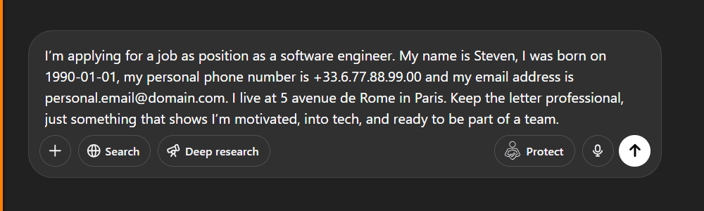

# PromptMask

Protect your messages before submitting them to AI chat platforms

[](https://www.typescriptlang.org/)
[](https://reactjs.org/)
[](https://mui.com/)
[](https://tailwindcss.com/)
[](https://www.plasmo.com/)


PromptMask helps you protect your sensitive prompts and personal information when using popular AI chat bots. It adds a "Protect" button to major AI platforms, ensuring your personal identifiable information (PII) is protected before being sent to AI services.

Supported **sites**:

- ChatGPT (chatgpt.com)
- Claude (claude.ai)
- Grok (grok.com)
- Qwen (chat.qwen.ai)

## Table of Contents

- [Features](#features)
- [Demo](#demo)
- [Getting Started](#getting-started)
- [Usage](#usage)
- [Configuration](#configuration)
- [Tech Stack](#tech-stack)
- [How It Works](#how-it-works)
- [Project Structure](#project-structure)
- [Contributing](#contributing)
- [Privacy Policy](#privacy-policy)
- [License](#license)
- [Support](#support)

## Features

- One-click protection for your AI chatbot prompts
- Privacy-first: all transformations happens locally in your browser
- Replaces sensitive personal information with generic placeholders
- Support for multiple major AI platforms
- Simple, intuitive UI with a "Protect" button
- Customizable personal information settings
- Built with React and Material UI for a modern experience
- Open source and auditable

## Demo



## Getting Started

1. Clone the repository:

   ```bash
   git clone https://github.com/wassim-azi/PromptMask.git
   cd PromptMask
   ```

2. Install dependencies:

   ```bash
   pnpm install
   ```

3. Start development mode (with hot reload):

   ```bash
   pnpm dev
   ```

4. For production build:

   ```bash
   pnpm build
   ```

5. Load the extension in Chrome:
   - Go to `chrome://extensions/`
   - Enable "Developer mode"
   - Click "Load unpacked"
   - Select the `build/chrome-mv3-dev` directory (for dev) or `build/chrome-mv3-prod` (for production)

## Usage

1. After installation, a "Protect" button will appear in supported AI chat bots
2. Configure your personal information in the extension options
3. When composing a message to an AI, click the "Protect" button to replace sensitive information
4. Your message will be sent with protected information

## Configuration

1. Click on the extension icon in your browser toolbar
2. Select "Options" to open the configuration page
3. Add your personal information that should be protected
4. Save your settings

## Tech Stack

PromptMask is built with modern web technologies:

- **[Plasmo Framework](https://www.plasmo.com/)**: A powerful browser extension framework
- **[React](https://reactjs.org/)**: For building the user interface
- **[TypeScript](https://www.typescriptlang.org/)**: For type-safe code
- **[Material UI](https://mui.com/)**: Component library for consistent design
- **[Tailwind CSS](https://tailwindcss.com/)**: Utility-first CSS framework (v3 compatible)
- **[Framer Motion](https://www.framer.com/motion/)**: For smooth animations
- **[Formik](https://formik.org/)**: For form management
- **[Yup](https://github.com/jquense/yup)**: For schema validation

## How It Works

1. **Local Processing**: Your data never leaves your browser - all transformations happen locally
2. **Pattern Recognition**: PromptMask identifies your configured personal information in prompt text
3. **Substitution**: It replaces personal info with placeholders (like `__FIRST_NAME__` instead of "John")
4. **Storage**: Your configuration is stored in your browser's local storage

## Project Structure

- `/contents`: Content scripts for different AI platforms (ChatGPT, Claude, Grok, Qwen)
- `/contents/shared`: Shared components used across content scripts
- `/contents/utils`: Utility functions for content scripts
- `/contents/types`: TypeScript type definitions
- `/contents/hooks`: React hooks for content scripts
- `/background`: Service worker and background scripts
- `/locales`: Internationalization files
- `/assets`: Images and other static resources

## Contributing

Contributions are welcome! Here's how you can help:

1. Fork the repository
2. Create a feature branch: `git checkout -b feature/amazing-feature`
3. Commit your changes: `git commit -m 'Add some amazing feature'`
4. Push to the branch: `git push origin feature/amazing-feature`
5. Open a Pull Request

See our [Contributing Guidelines](CONTRIBUTING.md) for more details.

## Privacy Policy

PromptMask is designed with privacy as the top priority:

- We never collect, transmit, or store your personal data
- All processing happens locally in your browser
- No analytics or tracking of any kind
- Your configuration remains in your browser's local storage

## License

PromptMask is licensed under the [GNU General Public License v3.0](LICENSE).

## Support

For questions, issues, or feature requests, please open an issue on [GitHub Issues](https://github.com/wassim-azi/PromptMask/issues).
